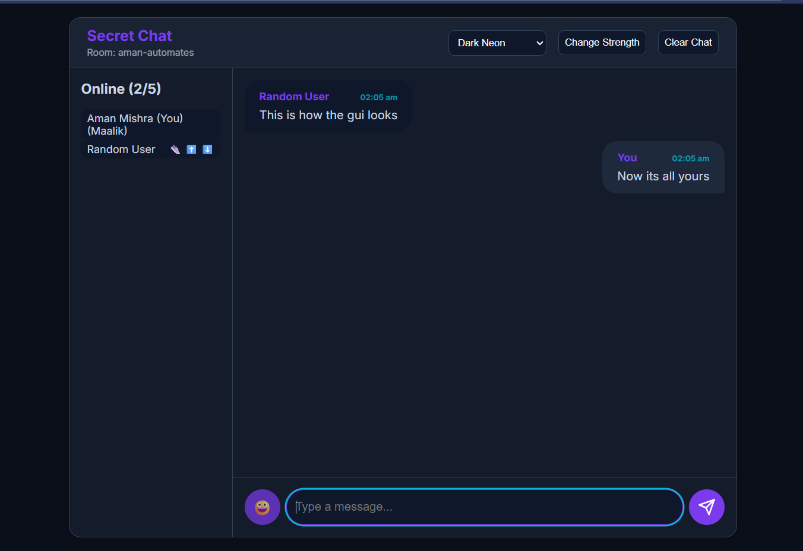

# EphemeralEcho 🤫

*A minimal, private, and theme-able web chat powered by Python and WebSockets.*

---


)
*(Representative example of a chat interface)*

**EphemeralEcho** is a lightweight, real-time chat application that prioritizes privacy. Create secure, password-protected chat rooms on the fly without needing an account. All conversations happen in memory and are wiped clean when the server restarts, ensuring no data is ever stored.

---

## ✨ Features

-   🔐 **Private Rooms:** Join chats with a shared secret code. No accounts, no data persistence.
-   ⚡ **Real-Time Messaging:** Instant communication powered by WebSockets.
-   🎨 **Live Theme Switching:** Choose from 10+ themes that sync instantly for all users in the room.
-   👑 **Room Controls:**
    -   **Owner (Maalik):** Full control to kick users, clear history, and manage admins.
    -   **Admins:** Can kick members.
-   📝 **Message History:** Loads the last 200 messages for joining users (non-persistent).
-   ↩️ **Message Replies & Editing:** Reply to specific messages and edit your own.
-   ⌨️ **Typing Indicator:** See when others are typing.
-   📱 **Responsive UI:** Works smoothly on both mobile and desktop.
-   🚀 **Lightweight & Deployable:** No database required. Deploy it easily on services like Render.

---

## 🛠️ Tech Stack

-   **Backend:** Python, Flask, Flask-SocketIO, Eventlet
-   **Frontend:** HTML5, CSS3, Vanilla JavaScript

---

## 🚀 Getting Started

### Prerequisites

-   Python 3.7+
-   A virtual environment tool like `venv` (recommended).

### 1. Clone the Repository

```bash
git clone https://github.com/AmanAutomates/EphemeralEcho.git
cd EphemeralEcho
```

### 2. Set Up a Virtual Environment

**macOS/Linux:**

```bash
python3 -m venv venv
source venv/bin/activate
```

**Windows:**

```bash
python -m venv venv
.\venv\Scripts\activate
```

### 3. Install Dependencies

```bash
pip install -r requirements.txt
```

### 4. Configure Your Environment

Create a `.env` file in the root of the project and add the following:

```env
SECRET_KEY='a_very_strong_and_random_secret_key_here'
OWNER_IP='your_static_ip_here'  # Optional: Grants owner privileges to this IP
```

### 5. Run the Server

```bash
python server.py
```

The application will be running at 👉 **[http://localhost:5000](http://localhost:5000)**

---

## 💬 How to Use

1.  Open your browser and navigate to the server address.
2.  Choose a nickname.
3.  Enter a secret room code (e.g., `project-launch-alpha`).
4.  (Optional) Set a maximum number of users for the room.
5.  Share the room code with friends and start chatting!

---

📢 To chat outside your LAN, use **ngrok**:

```bash
ngrok http 5000
```

---

## ☁️ Deployment

This application is ready for deployment on platforms like **Render**.

[](https://render.com/deploy)

1.  Fork this repository.
2.  On Render, create a new **Web Service** and connect your forked repository.
3.  Set the following commands:
    -   **Build Command:** `pip install -r requirements.txt`
    -   **Start Command:** `python server.py`
4.  Add your `SECRET_KEY` as an environment variable.

---

## 🛡️ Security Note

-   **No Data Storage:** Chat data is **never** written to disk. All messages exist only in memory and are cleared on server restart.
-   **Encryption:** For production use, always deploy with HTTPS to ensure communication is encrypted.

---

## 🤝 Contributing

Contributions are welcome! If you have ideas for improvements or find a bug, please open an issue or create a pull request.

1.  Fork the Project
2.  Create your Feature Branch (`git checkout -b feature/NewFeature`)
3.  Commit your Changes (`git commit -m 'Add some NewFeature'`)
4.  Push to the Branch (`git push origin feature/NewFeature`)
5.  Open a Pull Request

---

## 👨‍💻 Author

**Aman Mishra**

* YouTube: [@aman-automates](https://youtube.com/@aman-automates)
* Telegram Channel: [Jarvis by Aman](https://t.me/jarvisbyamanchannel)
* Telegram Group: [Discussion Group](https://t.me/jarvisbyaman)

---

## 📜 License

This project is licensed under the MIT License. See the `LICENSE` file for details.

